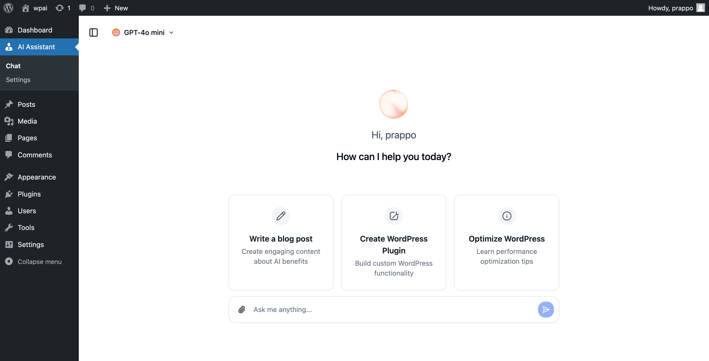

  
  <h1 align="center">WordPress AI Assistant</h1>
  
<a target="_blank" href="https://prappo.github.io/wordpress-ai-assistant/">Preview Plugin</a> | <a href="https://prappo.github.io/wordpress-ai-assistant/build/plugin/wordpress-ai-assistant.zip">Download Plugin</a>

